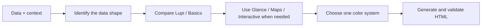

**English** | [简体中文](README.zh-CN.md)

<div align="center">
  <h1>Chartloom</h1>
  <p><strong>Turn data into publishable editorial charts and HTML reports.</strong></p>
</div>

<p align="center">
  <a href="LICENSE"></a>
  
  
  
</p>

<p align="center">
  Read the data shape → choose a real template → lock one color system → generate a single-file HTML deliverable.
</p>

---

## What is this?

**Chartloom** is a data-visualization Skill for AI agents. It identifies the data shape first, then chooses from real templates in the repository instead of falling back to a chart library's default style.

It produces polished HTML charts by default. Full-page templates are used only when the user explicitly asks for a report, annual report, monthly report, white paper, poster, or brief.

## Why use it?

| Capability | What it protects |
|---|---|
| 🧵 Template-driven output | Reuses validated chart structures instead of inventing a similar-looking chart |
| 📐 Honest encoding | Keeps length, area, color, and real values aligned |
| 👁️ Two reading speeds | Lupi supports close reading; Glance supports fast decisions |
| 🎨 One color system | Each delivery uses Mono, Porcelain, Palm, Wire, or one custom palette |
| 📄 Publishable output | Produces a single HTML file that opens without a build step |

## How it works



## Templates

| Family | Count | Best for |
|---|---:|---|
| Lupi Editorial | 20 | Long-form articles, papers, annual reports, posters, and data stories |
| Lupi Basics | 17 | Bars, lines, areas, scatterplots, heatmaps, box plots, and other familiar forms |
| Glance | 22 | Weekly reports, dashboards, monitoring, and presentations |
| Maps | 2 | United States and world maps |
| Interactive | 3 | Networks, paths, and dense relationship data |
| Report Templates | 12 bilingual layouts | Research, annual, monthly, poster, brief, and dashboard reports |

## Preview

<p align="center"></p>

[Open the interactive Force Graph template](https://chenjieliefu.github.io/chartloom/templates/big-force.html)

## Quick start

### Install

```bash
npx skills add https://github.com/chenjieliefu/chartloom --skill chartloom
```

Or clone the repository into your personal Skill directory:

```bash
git clone https://github.com/chenjieliefu/chartloom \
  "${CODEX_HOME:-$HOME/.codex}/skills/chartloom"
```

### Invoke

```text
Use $chartloom to turn this survey data into three Chinese HTML charts for a long-form article.
```

```text
Use $chartloom to turn this monthly business dataset into a Chinese HTML report.
```

## Repository structure

```text
.
├── SKILL.md
├── agents/openai.yaml
├── catalog.md
├── report-catalog.md
├── mono-tokens.js
├── color-presets.js
├── templates/
├── examples/
├── docs/assets/
└── scripts/validate.mjs
```

## License

This project is licensed under the [PolyForm Noncommercial License 1.0.0](LICENSE). Learning, modification, sharing, and noncommercial use are allowed. Commercial use requires separate permission.

Chart.js, Apache ECharts, and the Inter typeface remain under their original licenses. See [THIRD_PARTY_NOTICES.md](THIRD_PARTY_NOTICES.md).

---

<p align="center">
  <strong>Weave the data. Keep the truth.</strong>
</p>
