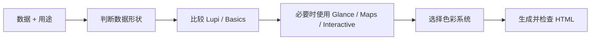

[English](README.md) | **简体中文**

<div align="center">
  <h1>Chartloom</h1>
  <p><strong>把数据变成可直接发布的编辑式图表与 HTML 报告。</strong></p>
</div>

<p align="center">
  <a href="LICENSE"></a>
  
  
  
</p>

<p align="center">
  判断数据形状 → 选择真实模板 → 锁定色彩系统 → 生成单文件 HTML。
</p>

---

## 这是什么？

**Chartloom** 是一个面向 AI Agent 的数据可视化 Skill。它不会直接套用图表库默认样式，而是先判断数据形状，再从仓库内的真实模板中选型。

默认交付精致的 HTML 图表。只有当用户明确要求报告、年报、月报、白皮书、海报或 brief 时，才使用整页报告模板。

## 为什么使用它？

| 能力 | 作用 |
|---|---|
| 🧵 模板驱动 | 沿用已验证的图表结构，不临时发明一张“差不多”的图 |
| 📐 诚实编码 | 保持长度、面积、颜色和真实数值的对应关系 |
| 👁️ 两种阅读速度 | Lupi 适合细读，Glance 适合快速判断 |
| 🎨 统一配色 | 一次交付只使用 Mono、Porcelain、Palm、Wire 或一套自定义色板 |
| 📄 可发布输出 | 生成无需构建、双击可打开的单文件 HTML |

## 它如何工作？



## 模板

| 类型 | 数量 | 适合场景 |
|---|---:|---|
| Lupi Editorial | 20 | 长文、论文、年报、海报和数据故事 |
| Lupi Basics | 17 | 柱、线、面积、散点、热力、箱线等基础图型 |
| Glance | 22 | 周报、dashboard、监控和汇报 |
| Maps | 2 | 美国地图和世界地图 |
| Interactive | 3 | 网络、路径和高密度关系数据 |
| Report Templates | 12 套中英文双版 | 调研、年报、月报、海报、简报和 dashboard |

## 预览

<p align="center"></p>

[打开 Force Graph 交互模板](https://chenjieliefu.github.io/chartloom/templates/big-force.html)

## 快速开始

### 安装

```bash
npx skills add https://github.com/chenjieliefu/chartloom --skill chartloom
```

也可以把仓库克隆到个人 Skill 目录：

```bash
git clone https://github.com/chenjieliefu/chartloom \
  "${CODEX_HOME:-$HOME/.codex}/skills/chartloom"
```

### 调用

```text
使用 $chartloom，把这份调研数据做成 3 张适合公众号的中文 HTML 图表。
```

```text
使用 $chartloom，把这份月度业务数据做成一份中文 HTML 报告。
```

## 仓库结构

```text
.
├── SKILL.md
├── agents/openai.yaml
├── catalog.md
├── report-catalog.md
├── mono-tokens.js
├── color-presets.js
├── templates/
├── examples/
├── docs/assets/
└── scripts/validate.mjs
```

## 许可

本项目使用 [PolyForm Noncommercial License 1.0.0](LICENSE)。允许学习、修改、分享和非商业使用；商业使用需要另行取得许可。

Chart.js、Apache ECharts 和 Inter 字体仍遵循各自的原始许可，详见 [THIRD_PARTY_NOTICES.md](THIRD_PARTY_NOTICES.md)。

---

<p align="center">
  <strong>Weave the data. Keep the truth.</strong>
</p>
